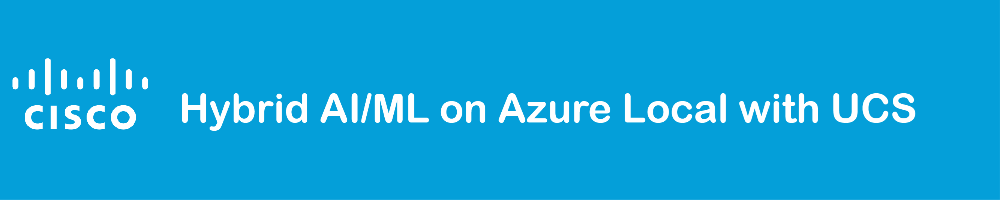

## Introduction

This repository provides comprehensive documentation and resources for deploying a hybrid AI/ML solution utilizing Azure Local on Cisco UCS hardware. The solution integrates Azure services with Cisco security and connectivity technologies to deliver a robust, secure, and scalable environment for AI/ML workloads.

This repo is part of the [Cisco Data Bridge Project Suite] (https://github.com/APO-SRE/cisco-data-bridge-project-suite)

## Table of Contents

- [Architecture Overview](#architecture-overview)
- [Getting Started](#getting-started)
- [Code Structure](#code-structure)
- [Deployment Guides](#deployment-guides)
  - [Azure Local Deployment](deployment/azure_local_deployment_guide.md)
  - [AKS on Azure Local Deployment](deployment/aks_deployment_guide.md)
  - [Chat App with Azure OpenAI Deployment](deployment/aoai_chat_deployment_guide.md)
  - [Hugging Face Deployment](deployment/hugging_face_guide.md)
  - [Machine Learning Deployment](deployment/ml_deployment_guide.md)
- [Cisco Technologies](#cisco-technologies)
  - [Splunk Integration](docs/cisco_splunk.md)
  - [HyperShield](docs/hypershield.md)
  - [ThousandEyes](docs/cisco_thousandeyes.md)
  - [Catalyst SD-WAN](docs/cisco_catalyst_sdwan.md)
  - [Azure Local on Cisco UCS](docs/cisco_azure_local.md)
  - [Multicloud Defense](docs/cisco_multicloud_defense.md)
  - [Secure Firewall](docs/cisco_secure_firewall.md)
  - [Intersight](docs/cisco_intersight.md)
- [Azure Services](#azure-services)
- [AI/ML Resources](#aiml-resources)
- [Cisco Azure Local AI Video Resources](#cisco-azure-local-ai-video-resources)
- [Deployment Options](#deployment-optionssecurity-considerations)
- [Contributing](#contributing)
- [License](#license)

## Architecture Overview

This section provides a high-level overview of the solution architecture, highlighting how Azure services and Cisco technologies integrate to support AI/ML workloads.

[Read more ➔](docs/architecture_overview.md)

## Getting Started

Follow these instructions to set up your environment and begin deploying the hybrid AI/ML solution.

[Read more ➔](docs/getting_started.md)

## Code Structure

The repository is organized into the following directories:

- `/docs`: Documentation files.
- `/code`: Source code for training and scoring pipelines.
- `/deployment`: Scripts and configurations for deployment.

[Read more ➔](docs/code_structure.md)

## Deployment Guides

Detailed deployment instructions for various components of the solution are provided below:

- **Azure Local Deployment**: [Deployment Guide](deployment/azure_local_deployment_guide.md)
- **AKS on Azure Local Deployment**: [Deployment Guide](deployment/aks_deployment_guide.md)
- **Chat App with Azure OpenAI Deployment**: [Deployment Guide](deployment/aoai_chat_deployment_guide.md)
- **Hugging Face Deployment**: [Deployment Guide](deployment/hugging_face_guide.md)
- **Machine Learning Deployment**: [Deployment Guide](deployment/ml_deployment_guide.md)

## Cisco Technologies

This section covers the Cisco technologies integrated into the solution:

- **[Splunk Integration](docs/cisco_splunk.md)**: Enables advanced analytics and insights.
- **[HyperShield](docs/hypershield.md)**: Secures data and workloads in hybrid environments.
- **[Robust Intelligence](docs/robust_intelligence.md)**: Secures data and workloads in hybrid environments.
- **[ThousandEyes](docs/cisco_thousandeyes.md)**: Offers network visibility and monitoring.
- **[Catalyst SD-WAN](docs/cisco_catalyst_sdwan.md)**: Enhances WAN performance and security.
- **[Azure Local on Cisco UCS](docs/cisco_azure_local.md)**: Details on deploying Azure Local on Cisco hardware.
- **[Multicloud Defense](docs/cisco_multicloud_defense.md)**: Provides security across multiple cloud environments.
- **[Secure Firewall](docs/cisco_secure_firewall.md)**: Protects against threats with advanced firewall capabilities.
- **[Intersight](docs/cisco_intersight.md)**: Simplifies infrastructure management and operations.

## Azure Services

An overview of the Azure services utilized in this solution and their roles:

- **Azure Local**
- **Azure Kubernetes Service (AKS)**
- **Azure Arc**
- **Azure Machine Learning**
- **Azure OpenAI**
- **Azure Storage**

[Read more ➔](docs/azure_services.md)

## AI/ML Resources

Access tutorials, examples, and resources to help you understand and implement AI/ML workloads in this hybrid environment.
- **Generative AI Concepts**: [Microsoft Learn](https://learn.microsoft.com/azure/ai-services/openai/concepts/use-your-data)
- **Sample Azure Openai Applications**: [GitHub Repository](https://github.com/microsoft/sample-app-aoai-chatGPT)
  
## Cisco Azure Local AI Video Resources
Explore Cisco’s Azure Local AI/ML capabilities through the following video resources:

- **Cisco AI-Driven Secure Enterprise Data Architecture Overview**: [Watch Video](https://vimeo.com/1029648222?share=copy#t=0)  
- **Cisco AI Machine Learning**: [Watch Video](https://vimeo.com/1029723696?share=copy#t=0)  
- **Cisco Generative A**I: [Watch Video](https://vimeo.com/1029776033?share=copy#t=0)

## Deployment Options/Security Considerations

Explore various deployment models and security considerations for Large Language Models (LLMs) and Machine Learning workloads.

[Read more ➔](deployment/deployment_options.md)

## Contributing

We welcome contributions to enhance this project. Please read our [contribution guidelines](docs/CONTRIBUTING.md) to get started.

## License
This project is licensed under the Apache License, Version 2.0. See the [LICENSE](LICENSE) file for details.

