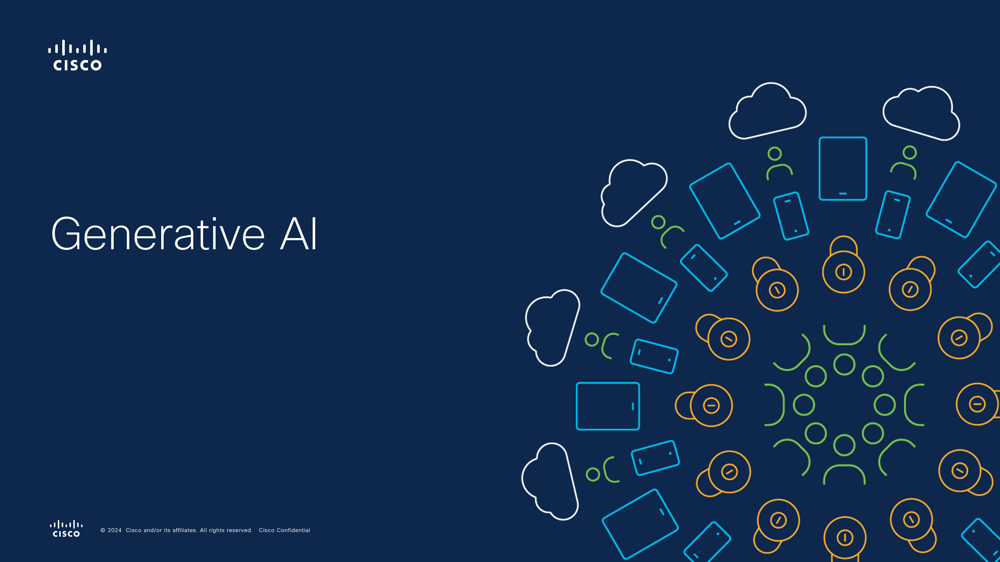

# Azure OpenAI Chat App Deployment Guide

This guide provides step-by-step instructions to deploy the Sample Chat App with Azure OpenAI on Azure Kubernetes Service (AKS). You have two deployment options:

- **Option 1**: Deploy the app as an Azure App Service on AKS via Azure Arc.
- **Option 2**: Deploy the app as a container on AKS.

---

## Table of Contents

- [Introduction](#introduction)
- [Video - Cisco Generative AI](#video---cisco-generative-ai)
- [Prerequisites](#prerequisites)
- [Deployment Options](#deployment-options)
  - [Option 1: Deploy as an Azure App Service on AKS via Azure Arc](#option-1-deploy-as-an-azure-app-service-on-aks-via-azure-arc)
    - [Overview](#overview)
    - [Steps](#steps)
  - [Option 2: Deploy as a Container on AKS](#option-2-deploy-as-a-container-on-aks)
    - [Overview](#overview-1)
    - [Steps](#steps-1)
- [Conclusion](#conclusion)
- [References](#references)

---

## Introduction

This guide walks you through deploying the [Sample Chat App with Azure OpenAI](https://github.com/microsoft/sample-app-aoai-chatGPT) on Azure Kubernetes Service (AKS). The app is a web application that integrates with Azure OpenAI to provide chat capabilities. You can choose between deploying it as an Azure App Service on AKS via Azure Arc or as a containerized application on AKS.

---
---

## Video - Cisco Generative AI 
[](https://vimeo.com/1029776033?share=copy#t=0)

---

## Prerequisites

Before you begin, ensure you have the following:

- **Azure Subscription**: An active Azure subscription.
- **Azure OpenAI Resource**: An existing Azure OpenAI resource with a deployed chat model (e.g., `gpt-35-turbo-16k`, `gpt-4`).
- **Azure Kubernetes Service (AKS) Cluster**: A running AKS cluster.
- **Azure CLI**: Installed and configured on your machine.
- **Docker**: Installed if you plan to build and push Docker images.
- **Azure Container Registry (ACR)**: If deploying as a container, to store your Docker images.
- **Azure Arc-Enabled Kubernetes Cluster**: Required if deploying as an Azure App Service via Azure Arc.

---

## Deployment Options

### Option 1: Deploy as an Azure App Service on AKS via Azure Arc

#### Overview

By deploying the app as an Azure App Service on AKS via Azure Arc, you can manage your application using familiar Azure services while running it on your on-premises or cloud-based Kubernetes cluster.

## Prerequisites
Ensure your Azure Local cluster is properly deployed on Cisco UCS hardware and that AKS is installed and connected to Azure Arc.
References:
  - [Azure Local Deployment](hci_deployment_guide.md)
  - [AKS on Azure Local Deployment](aks_deployment_guide.md)


#### Steps

1. **Install the App Service Extension**


     ```
   - **Install the App Service Extension**:
     ```bash
     az k8s-extension create \
       --resource-group <resource-group> \
       --name <extension-name> \
       --cluster-type connectedClusters \
       --cluster-name <cluster-name> \
       --extension-type 'Microsoft.Web.Appservice' \
       --release-train stable \
       --auto-upgrade-minor-version true \
       --scope cluster \
       --release-namespace <namespace> \
       --configuration-settings "Microsoft.CustomLocation.ServiceAccount=default" \
       --configuration-settings "appsNamespace=<namespace>" \
       --configuration-settings "clusterName=<kube-environment-name>" \
       --configuration-settings "keda.enabled=true" \
       --configuration-settings "buildService.storageClassName=default" \
       --configuration-settings "buildService.storageAccessMode=ReadWriteOnce"
     ```
   - **Create a Custom Location**:
       *The custom location in Azure is used to assign the App Service Kubernetes environment.*
     ```bash
     az customlocation create \
       --resource-group <resource-group> \
       --name <custom-location-name> \
       --host-resource-id <connected-cluster-id> \
       --namespace <namespace> \
       --cluster-extension-ids <extension-id>
     ```
   - **Create the App Service Kubernetes Environment**:
       *The App Service Kubernetes environment resource is required before apps can be created. It enables configuration common to apps in the custom location, such as the default DNS suffix*
     ```bash
     az appservice kube create \
       --resource-group <resource-group> \
       --name <kube-environment-name> \
       --custom-location <custom-location-id>
     ```

2. **Deploy the Sample Chat App**

   - **Clone the Sample Chat App Repository**:

     ```bash
     git clone https://github.com/microsoft/sample-app-aoai-chatGPT
     cd sample-app-aoai-chatGPT
     ```

   - **Configure the App**:

     - Create a `.env` file based on `.env.sample` and populate it with your Azure OpenAI resource details and other settings as per your requirements.

     - **Create a JSON file for Azure App Service Settings**:

       ```bash
       cat .env | jq -R '. | capture("(?<name>[A-Z_]+)=(?<value>.*)")' | jq -s '.[].slotSetting=false' > env.json
       ```

   - **Create an Azure App Service**:

     Use the Azure CLI to create an App Service in your custom location:

     ```bash
     az webapp create \
       --resource-group <resource-group> \
       --name <app-name> \
       --custom-location <custom-location-id> \
       --runtime 'PYTHON|3.11'
     ```

   - **Deploy Your Code to the App Service**:

     - **Build the App**:

       ```bash
       ./start.sh  # or 'start.cmd' on Windows
       ```

     - **Deploy Using Azure CLI**:

       ```bash
       az webapp up \
         --resource-group <resource-group> \
         --name <app-name> \
         --custom-location <custom-location-id> \
         --runtime 'PYTHON|3.11'
       ```

     - **Set the Startup Command**:

       ```bash
       az webapp config set \
         --name <app-name> \
         --resource-group <resource-group> \
         --startup-file "python3 -m gunicorn app:app"
       ```

   - **Configure Authentication (Optional but Recommended)**:

     - Add an identity provider to your App Service to secure your application.

     - **Reference**: [Add authentication to your web app](https://learn.microsoft.com/azure/app-service/scenario-secure-app-authentication-app-service)

3. **Verify the Deployment**

   - Access your app via the URL:

     ```
     https://<app-name>.<your-custom-domain>
     ```

   - Test the chat functionality to ensure it's working as expected.

**Note**: This deployment method allows you to leverage Azure App Service features, such as scaling and deployment slots, while running your app on your own AKS cluster.

---

### Option 2: Deploy as a Container on AKS

#### Overview

Deploying the app as a container on AKS gives you full control over the containerization process and deployment. This method involves building a Docker image of the app and deploying it to your AKS cluster.

## Prerequisites
Ensure your Azure Local cluster is properly deployed on Cisco UCS hardware and that AKS is installed and connected to Azure Arc.
References:
  - [Azure Local Deployment](azure_local_deployment_guide.md)
  - [AKS on Azure Local Deployment](aks_deployment_guide.md)
    
#### Steps

1. **Clone the Sample Chat App Repository**

   ```bash
   git clone https://github.com/microsoft/sample-app-aoai-chatGPT
   cd sample-app-aoai-chatGPT
   ```

2. **Create a Dockerfile**

   Create a `Dockerfile` in the root of the project with the following content:

   ```dockerfile
   # Use an official Python runtime as a parent image
   FROM python:3.10

   # Set the working directory in the container
   WORKDIR /app

   # Copy the current directory contents into the container at /app
   COPY . /app

   # Install any needed packages specified in requirements.txt
   RUN pip install --no-cache-dir -r requirements.txt

   # Expose port 80
   EXPOSE 80

   # Run app.py when the container launches
   CMD ["python", "app.py"]
   ```

3. **Modify the Application (if necessary)**

   - Ensure that the `app.py` file is configured to run the application on port 80 and listen on all interfaces (`0.0.0.0`).

     Example snippet at the end of `app.py`:

     ```python
     if __name__ == "__main__":
         app.run(host='0.0.0.0', port=80)
     ```

4. **Build and Push the Docker Image**

   - Log in to your Azure Container Registry (ACR):

     ```bash
     az acr login --name <your-acr-name>
     ```

   - Build and push the Docker image:

     ```bash
     docker build -t <your-acr-name>.azurecr.io/aoai-chat-app:latest .
     docker push <your-acr-name>.azurecr.io/aoai-chat-app:latest
     ```

5. **Deploy to AKS**

   - **Create a Kubernetes Deployment and Service Manifest** (e.g., `deployment.yaml`):

     ```yaml
     apiVersion: apps/v1
     kind: Deployment
     metadata:
       name: aoai-chat-app
     spec:
       replicas: 1
       selector:
         matchLabels:
           app: aoai-chat-app
       template:
         metadata:
           labels:
             app: aoai-chat-app
         spec:
           containers:
           - name: aoai-chat-app
             image: <your-acr-name>.azurecr.io/aoai-chat-app:latest
             ports:
             - containerPort: 80
             env:
             - name: ENV_VAR_NAME
               value: "value"
     ---
     apiVersion: v1
     kind: Service
     metadata:
       name: aoai-chat-app-service
     spec:
       type: LoadBalancer
       selector:
         app: aoai-chat-app
       ports:
       - protocol: TCP
         port: 80
         targetPort: 80
     ```

   - **Apply the Manifest to Your AKS Cluster**:

     ```bash
     kubectl apply -f deployment.yaml
     ```

6. **Configure the Application**

   - **Set Up Environment Variables and Secrets**:

     - Create a Kubernetes Secret for sensitive data:

       ```bash
       kubectl create secret generic aoai-secrets \
         --from-literal=AZURE_OPENAI_KEY=<your-azure-openai-key>
       ```

     - Update your deployment to use the secret:

       ```yaml
       env:
       - name: AZURE_OPENAI_KEY
         valueFrom:
           secretKeyRef:
             name: aoai-secrets
             key: AZURE_OPENAI_KEY
       ```

     - Add other environment variables as needed in your deployment manifest.

7. **Verify the Deployment**

   - **Get the External IP Address of the Service**:

     ```bash
     kubectl get service aoai-chat-app-service
     ```

   - **Access the Application**:

     - Navigate to `http://<external-ip>` in your web browser.

   - **Test the Chat Functionality**:

     - Ensure the application is working as expected by sending messages through the chat interface.

---

## Conclusion

By following this guide, you can deploy the Sample Chat App with Azure OpenAI on AKS using either an Azure App Service via Azure Arc or as a containerized application. Choose the deployment option that best fits your operational needs and infrastructure.

---

## References

- **Sample Chat App with Azure OpenAI**: [GitHub Repository](https://github.com/microsoft/sample-app-aoai-chatGPT)
- **Azure Arc Documentation**:
  - [App Service, Functions, and Logic Apps on Azure Arc (Preview)](https://learn.microsoft.com/azure/app-service/overview-arc-integration)
  - [Set up an Azure Arc-enabled Kubernetes cluster to run App Service](https://learn.microsoft.com/azure/app-service/manage-create-arc-environment?tabs=bash)
  - [Create an App Service app on Azure Arc (Preview)](https://learn.microsoft.com/azure/app-service/quickstart-arc)
- **AKS Documentation**:
  - [Quickstart: Deploy an Azure Kubernetes Service cluster](https://learn.microsoft.com/azure/aks/kubernetes-walkthrough)
- **Docker Documentation**:
  - [Dockerfile Reference](https://docs.docker.com/engine/reference/builder/)
- **Azure OpenAI Documentation**:
  - [Azure OpenAI Service](https://learn.microsoft.com/azure/cognitive-services/openai/overview)

---

**Note**: This guide provides a high-level overview of the deployment process. For detailed instructions, best practices, and troubleshooting, please refer to the official Microsoft documentation linked above.

---
