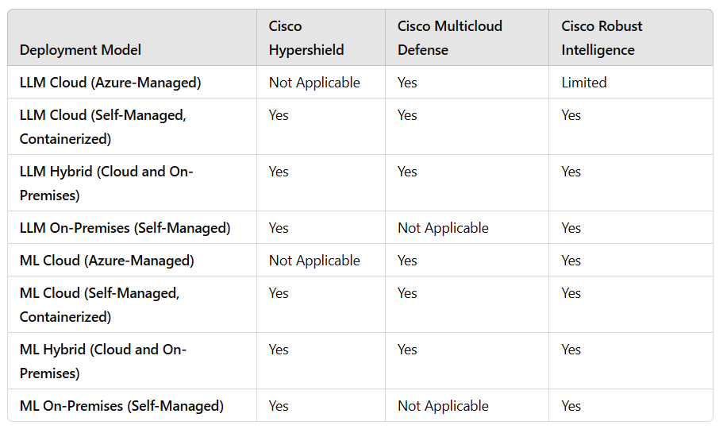

Here is the combined file with the table of contents at the top, matching the structure and formatting:

---

# Deployment Options for Large Language Models (LLMs) and Machine Learning (ML) Workloads

This document outlines deployment options for Large Language Models (LLMs) and Machine Learning (ML) workloads, as well as chat endpoints in various environments (cloud, on-premises, hybrid), and explains the Cisco security solutions suitable for each deployment type. Cisco offers flexible security solutions tailored to meet specific needs depending on whether the deployment is Azure-managed or self-managed.

---

## Table of Contents

- [Introduction](#introduction)
- [Deployment Options Diagram](#deployment-options-diagrahm)
- [Deployment Options](#deployment-options)
  - [LLM Deployment Models](#llm-deployment-models)
    - [LLM in Cloud Deployment Models](#llm-in-cloud-deployment-models)
    - [LLM On-Premises Deployment Models](#llm-on-premises-deployment-models)
  - [Machine Learning Deployment Options](#machine-learning-deployment-options)
- [Large Language Model (LLM) Deployment Models](#large-language-model-llm-deployment-models)
  - [Cloud Azure-Managed LLM](#cloud-azure-managed-llm)
  - [Cloud Self-Managed LLM (Containerized)](#cloud-self-managed-llm-containerized)
  - [On-Premises Self-Managed LLM (Containerized)](#on-premises-self-managed-llm-containerized)
- [Chat Endpoint and Machine Learning (ML) Deployment Models](#chat-endpoint-and-machine-learning-ml-deployment-models)
  - [Cloud Azure-Managed](#cloud-azure-managed)
  - [Cloud Self-Managed (Containerized)](#cloud-self-managed-containerized)
  - [On-Premises Azure-Managed](#on-premises-azure-managed)
  - [On-Premises Self-Managed (Containerized)](#on-premises-self-managed-containerized)
- [Managed vs Unmanaged](#managed-vs-unmanaged)
  - [Managed](#managed)
  - [Unmanaged](#unmanaged)
- [Can you mix Managed and Unmanaged?](#can-you-mix-managed-and-unmanaged)
  - [Benefits of Mixing Managed and Unmanaged Endpoints](#benefits-of-mixing-managed-and-unmanaged-endpoints)
  - [Example Use Cases](#example-use-cases)
  - [Considerations](#considerations)
- [Summary Table of Cisco Security Solutions by Deployment Model](#summary-table-of-cisco-security-solutions-by-deployment-model)
- [References](#references)

---

## Introduction

This document outlines deployment options for Large Language Models (LLMs) and Machine Learning (ML) workloads, as well as chat endpoints in various environments (cloud, on-premises, hybrid), and explains the Cisco security solutions suitable for each deployment type. Cisco offers flexible security solutions tailored to meet specific needs depending on whether the deployment is Azure-managed or self-managed.

---
## Deployment Options Diagram

*Figure: High-level overview of the Cisco AI-Driven Enterprise Data Architecture.*

## Deployment Options

The architecture offers flexible deployment models for LLMs and Machine Learning workloads, accommodating various organizational needs.

### LLM Deployment Models

**LLM in Cloud Deployment Models**

1. **LLM in Cloud with Managed Cloud Endpoint**
2. **LLM in Cloud with Unmanaged Cloud Endpoint**
3. **LLM in Cloud with Managed On-Premises Endpoint**
4. **LLM in Cloud with Unmanaged On-Premises Endpoint**
5. **LLM in Cloud with Managed Hybrid Endpoints (Cloud and On-Premises)**
6. **LLM in Cloud with Unmanaged Hybrid Endpoints (Cloud and On-Premises)**
7. **LLM in Cloud with Mixed Managed/Unmanaged Hybrid Endpoints**
8. **LLM in Cloud with Mixed Unmanaged/Managed Hybrid Endpoints**

**LLM On-Premises Deployment Models**

9. **LLM On-Premises with Managed On-Premises Endpoint**
10. **LLM On-Premises with Unmanaged On-Premises Endpoint**
11. **LLM On-Premises with Managed Cloud Endpoint**
12. **LLM On-Premises with Unmanaged Cloud Endpoint**
13. **LLM On-Premises with Managed Hybrid Endpoints (Cloud and On-Premises)**
14. **LLM On-Premises with Unmanaged Hybrid Endpoints (Cloud and On-Premises)**
15. **LLM On-Premises with Mixed Managed/Unmanaged Hybrid Endpoints**
16. **LLM On-Premises with Mixed Unmanaged/Managed Hybrid Endpoints**

*Note: In all these models, the underlying infrastructure is deployed as a service through Azure. The terms 'managed' and 'unmanaged' relate to the endpoint application, not the infrastructure.*

---

### Machine Learning Deployment Options

1. **Training, Inference, and Endpoint using Cloud Compute**
2. **Training using HCI Compute; Inference and Endpoint using Cloud Compute**
3. **Training and Inference using HCI Compute; Endpoint using Cloud Compute**
4. **Training, Inference, and Endpoint using HCI Compute**
5. **Training using Cloud Compute; Inference and Endpoint using HCI Compute**
6. **Training using Cloud Compute; Inference using HCI Compute; Endpoint using Cloud Compute**
7. **Training using HCI Compute; Inference using Cloud Compute; Endpoint using HCI Compute**
8. **Training and Inference using Cloud Compute; Endpoint using HCI Compute**

These deployment options provide flexibility to balance performance, cost, data sovereignty, and compliance requirements.

---

## 1. Large Language Model (LLM) Deployment Models

LLM deployment models are categorized into three types, each with distinct levels of control and security integration. The primary focus is on securing the LLM itself, while chat endpoints are covered in a separate section.

### 1.1 Cloud Azure-Managed LLM

In this model, LLMs are fully managed by Azure (e.g., Azure OpenAI). Limited control over the infrastructure restricts certain security customizations, so Cisco’s security focus is on securing network boundaries and managing network policies.

- **Cisco Multicloud Defense**: Provides secure, unified policy management for multi-cloud deployments, offering ingress, egress, and lateral protection across environments.

### 1.2 Cloud Self-Managed LLM (Containerized)

For LLMs deployed in cloud environments under user control (e.g., containerized deployments on Azure Kubernetes Service (AKS) or other clouds), Cisco’s solutions offer comprehensive security by protecting workloads and enhancing compliance.

- **Cisco Hypershield**: Ensures secure, scalable segmentation within large-scale AI environments. Autonomous segmentation and kernel access minimization enhance security for complex cloud workloads.
- **Cisco Multicloud Defense**: Supports dynamic policy management across cloud environments, with ingress, egress, and east-west protection.
- **Cisco Robust Intelligence**: Provides model robustness monitoring, data drift detection, and ethical compliance. It helps mitigate adversarial risks and maintain data consistency for self-managed LLMs.

### 1.3 On-Premises Self-Managed LLM (Containerized)

For LLMs hosted on-premises, managed directly by the organization, Cisco security solutions can be applied across the infrastructure for maximum control and compliance.

- **Cisco Hypershield**: Key for protecting high-security, high-performance environments. Hypershield’s autonomous security model and real-time vulnerability detection are well-suited for on-prem LLM workloads.
- **Cisco Robust Intelligence**: Monitors model robustness, data drift, and ethical compliance within secured on-premises deployments, preventing adversarial attacks and data inconsistencies.

---

## 2. Chat Endpoint and Machine Learning (ML) Deployment Models

ML workloads and chat endpoints have four deployment options based on the environment and management type. In each case, Cisco provides security solutions that address the unique challenges of data protection, model robustness, and secure access.

### 2.1 Cloud Azure-Managed

When ML models and chat endpoints are managed by Azure (e.g., Azure ML or Azure-hosted chat endpoints), the primary security focus is on data access and endpoint security.

- **Cisco Multicloud Defense**: For securing network communication to and from Azure-managed ML models or chat endpoints. It provides ingress, egress, and lateral security within multi-cloud settings.
- **Cisco Robust Intelligence**: Offers continuous testing and monitoring of ML models or chat endpoints deployed in production to detect and mitigate data drift and adversarial risks.

### 2.2 Cloud Self-Managed (Containerized)

For ML and chat endpoints hosted in self-managed containers on AKS or similar cloud environments, Cisco solutions protect the entire infrastructure, including compute, data, and API interactions.

- **Cisco Hypershield**: Protects large-scale ML workloads and chat endpoints in high-performance cloud environments. Hypershield’s eBPF-based segmentation and autonomous policy management are critical for complex deployments.
- **Cisco Multicloud Defense**: Provides consistent security policies across cloud deployments, managing security policies with tag-based, dynamic adaptation.
- **Cisco Robust Intelligence**: Enhances data integrity and model resilience, providing real-time monitoring of model robustness, data drift, and adversarial risks.

### 2.3 On-Premises Azure-Managed

In this model, ML and chat endpoints are managed by Azure, but deployed on-premises. Cisco’s solutions provide secure access to these resources, with a focus on ensuring consistent policies and secure communication.

- **Cisco Multicloud Defense**: Manages security across on-premises Azure resources, protecting against ingress, egress, and lateral threats.
- **Cisco Robust Intelligence**: Ensures data consistency and resilience against adversarial risks for on-premises Azure-managed ML models and chat endpoints.

### 2.4 On-Premises Self-Managed (Containerized)

For ML and chat endpoints deployed entirely on-premises under self-management, Cisco offers maximum control over infrastructure and security,

 suitable for highly regulated industries or sensitive data environments.

- **Cisco Hypershield**: Provides robust security for high-performance ML and chat endpoint environments, ensuring segmentation and kernel access minimization.
- **Cisco Robust Intelligence**: Maintains model robustness, monitors data integrity, and defends against adversarial risks for production models deployed on-premises.

---

## Managed vs Unmanaged

In the context of deployment options, "managed" vs. "unmanaged" typically refers to the level of control and responsibility over the infrastructure, platform, and sometimes even applications.

### Managed

- **Managed** deployments are where the service provider (e.g., Azure) takes on most of the responsibility for infrastructure, platform, and sometimes even application management.
- The organization using the service has less control over customization but benefits from the ease of use, automation, and support.

### Unmanaged

- **Unmanaged** deployments give the organization more control over the setup, configuration, and customization of the environment.
- The organization is responsible for managing the infrastructure, including aspects like networking, security, scaling, updates, and compliance.

This distinction helps organizations decide between ease of use (managed) versus control and flexibility (unmanaged), depending on their security, compliance, and performance needs.

---

## Can you mix Managed and Unmanaged?

Yes, you can mix managed and unmanaged endpoints within your deployment architecture. This hybrid approach allows balancing control and customization with ease of management.

### Benefits of Mixing Managed and Unmanaged Endpoints

1. **Flexibility**
2. **Cost Efficiency**
3. **Performance Optimization**
4. **Security and Compliance**

### Example Use Cases

1. **LLM in Cloud with Mixed Managed/Unmanaged Hybrid Endpoints**
2. **LLM On-Premises with Mixed Unmanaged/Managed Hybrid Endpoints**

### Considerations

1. **Interoperability**
2. **Network Security**
3. **Compliance**
4. **Operational Complexity**

---

## Summary Table of Cisco Security Solutions by Deployment Model

---

## References

- **[Robust Intelligence](/docs/robust_intelligence.md)**: Secures data and workloads in hybrid environments.
- **[HyperShield](/docs/hypershield.md)**: Secures data and workloads in hybrid environments.
- **[Multicloud Defense](/docs/cisco_multicloud_defense.md)**: Provides security across multiple cloud environments.
- **[Secure Firewall](/docs/cisco_secure_firewall.md)**: Protects against threats with advanced firewall capabilities.

---

Let me know if you need any further changes.
