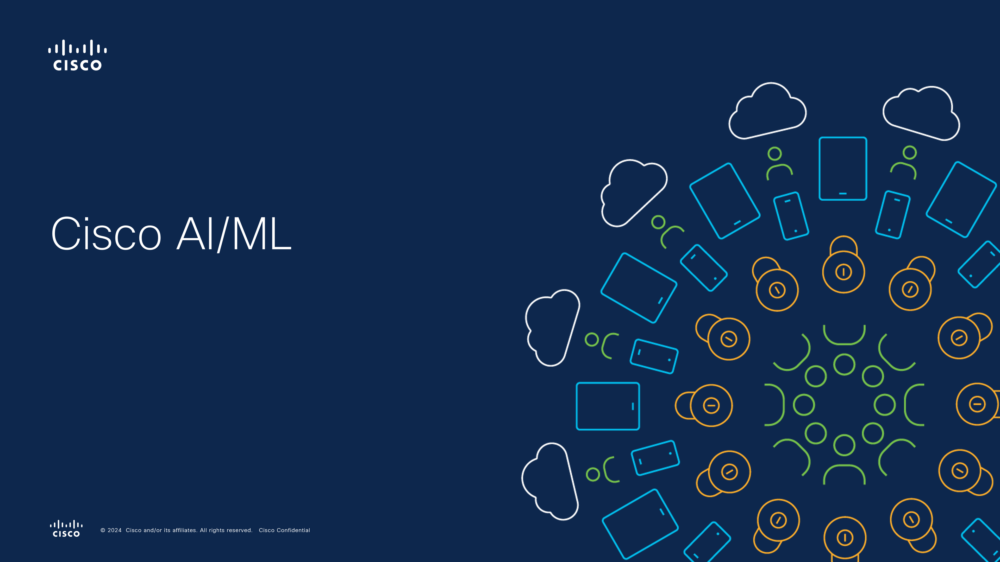

# Machine Learning Deployment Guide

This guide provides step-by-step instructions to set up the environment necessary to run training and scoring pipelines for your machine learning models on Azure Local with Cisco UCS hardware. By the end of this guide, you will have a fully configured Azure Machine Learning workspace integrated with your Kubernetes cluster, ready to execute the pipelines outlined in the `code_structure.md`.

---

## Table of Contents

- [Introduction](#introduction)
- [Video - Cisco AI-Machine Learning](#video---cisco-ai-machine-learning)
- [Prerequisites](#prerequisites)
- [Architecture Overview](#architecture-overview)
- [Deployment Steps](#deployment-steps)
  - [1. Set Up Azure Resources](#1-set-up-azure-resources)
  - [2. Deploy Azure Machine Learning Extension on AKS or Arc Kubernetes Cluster](#2-deploy-azure-machine-learning-extension-on-aks-or-arc-kubernetes-cluster)
  - [3. Attach Kubernetes Cluster to Azure Machine Learning Workspace](#3-attach-kubernetes-cluster-to-azure-machine-learning-workspace)
  - [4. Create and Configure Instance Types](#4-create-and-configure-instance-types)
  - [5. Verify the Setup](#5-verify-the-setup)
- [Post-Deployment Configuration](#post-deployment-configuration)
- [References](#references)
- [Additional Resources](#additional-resources)

---

## Introduction

This guide walks you through deploying a hybrid AI/ML solution on Azure Local with Cisco UCS hardware. The goal is to set up the environment so that you can run training and scoring pipelines described in the `code_structure.md`. The process involves creating necessary Azure resources, configuring your Kubernetes cluster, and integrating it with Azure Machine Learning services.

---

## Video - Cisco AI-Machine Learning 
[](https://vimeo.com/1029723696?share=copy#t=0)

---

## Prerequisites

Before you begin, ensure you have the following:

- **Azure Subscription**: An active Azure subscription with appropriate permissions.
- **Azure Local Cluster**: Deployed and configured on Cisco UCS hardware.
- **Azure Kubernetes Service (AKS) or Azure Arc-enabled Kubernetes Cluster**: Set up on your Azure Local.
- **Azure CLI**: Installed and configured on your local machine.
- **Azure Machine Learning CLI Extension**: Installed (`azure-ai-ml`).
- **Docker**: Installed if you plan to build and push Docker images.
- **Internet Connectivity**: Required for pulling Docker images and connecting to Azure services.

---

## Architecture Overview

The deployment consists of the following components:

- **Azure Machine Learning Workspace**: Central hub for managing ML resources.
- **Azure Resources**: Storage Account, Key Vault, Container Registry, Application Insights.
- **Kubernetes Cluster**: AKS or Arc-enabled Kubernetes cluster running on Azure Local.
- **Azure Machine Learning Extension**: Deployed on the Kubernetes cluster to enable ML workloads.
- **Managed Identity**: Used for secure access to Azure resources.
- **Training and Scoring Pipelines**: Executed on the Kubernetes cluster using Azure Machine Learning.

---

## Deployment Steps

### 1. Set Up Azure Resources

Before creating the Azure Machine Learning workspace, set up the following resources with a user-assigned managed identity and assign required roles:

#### a. Create a Resource Group

```bash
az group create --name <resource-group-name> --location <location>
```

#### b. Create a User-assigned Managed Identity

```bash
az identity create --name <identity-name> --resource-group <resource-group-name>
```

#### c. Create a Storage Account

```bash
az storage account create \
  --name <storage-account-name> \
  --resource-group <resource-group-name> \
  --location <location> \
  --sku Standard_LRS
```

#### d. Create a Key Vault

```bash
az keyvault create \
  --name <key-vault-name> \
  --resource-group <resource-group-name> \
  --location <location>
```

#### e. Create an Application Insights Resource

```bash
az monitor app-insights component create \
  --app <app-insights-name> \
  --location <location> \
  --resource-group <resource-group-name>
```

#### f. Create an Azure Container Registry

```bash
az acr create \
  --resource-group <resource-group-name> \
  --name <acr-name> \
  --sku Basic
```

#### g. Assign Roles to Managed Identity

Assign the following roles to your managed identity to enable access to all necessary resources:

1. **Azure Machine Learning Workspace**: Contributor
2. **Azure Storage**: Contributor (control plane) + Storage Blob Data Contributor (data plane)
3. **Azure Key Vault (RBAC Model)**: Contributor (control plane) + Key Vault Administrator (data plane)
4. **Azure Key Vault (Access Policies Model)**: Contributor + access policy permissions (excluding purge)
5. **Azure Container Registry**: Contributor
6. **Azure Application Insights**: Contributor

```bash
# Assign 'Contributor' role to AML workspace
az role assignment create \
  --assignee <managed-identity-id> \
  --role "Contributor" \
  --scope /subscriptions/<subscription-id>/resourceGroups/<resource-group-name>/providers/Microsoft.MachineLearningServices/workspaces/<workspace-name>

# Assign 'Contributor' role (control plane) for Storage Account
az role assignment create \
  --assignee <managed-identity-id> \
  --role "Contributor" \
  --scope /subscriptions/<subscription-id>/resourceGroups/<resource-group-name>/providers/Microsoft.Storage/storageAccounts/<storage-account-name>

# Assign 'Storage Blob Data Contributor' role (data plane) for Storage Account
az role assignment create \
  --assignee <managed-identity-id> \
  --role "Storage Blob Data Contributor" \
  --scope /subscriptions/<subscription-id>/resourceGroups/<resource-group-name>/providers/Microsoft.Storage/storageAccounts/<storage-account-name>

# Assign 'Contributor' role (control plane) for Key Vault
az role assignment create \
  --assignee <managed-identity-id> \
  --role "Contributor" \
  --scope /subscriptions/<subscription-id>/resourceGroups/<resource-group-name>/providers/Microsoft.KeyVault/vaults/<key-vault-name>

# Assign 'Key Vault Administrator' role (data plane) for Key Vault
az role assignment create \
  --assignee <managed-identity-id> \
  --role "Key Vault Administrator" \
  --scope /subscriptions/<subscription-id>/resourceGroups/<resource-group-name>/providers/Microsoft.KeyVault/vaults/<key-vault-name>

# Assign 'Contributor' role for Container Registry
az role assignment create \
  --assignee <managed-identity-id> \
  --role "Contributor" \
  --scope /subscriptions/<subscription-id>/resourceGroups/<resource-group-name>/providers/Microsoft.ContainerRegistry/registries/<acr-name>

# Assign 'Contributor' role for Application Insights
az role assignment create \
  --assignee <managed-identity-id> \
  --role "Contributor" \
  --scope /subscriptions/<subscription-id>/resourceGroups/<resource-group-name>/providers/microsoft.insights/components/<app-insights-name>
```

#### h. Create the Azure Machine Learning Workspace

```bash
az ml workspace create \
  --name <workspace-name> \
  --resource-group <resource-group-name> \
  --location <location> \
  --storage-account <storage-account-name> \
  --key-vault <key-vault-name> \
  --app-insights <app-insights-name> \
  --container-registry <acr-name> \
  --identity-type UserAssigned \
  --user-assigned-identity <managed-identity-id>
```

#### i. Update workspaceblobstore to Key Authentication
az ml datastore update \
  --name workspaceblobstore \
  --workspace-name <workspace-name> \
  --resource-group <resource-group-name> \
  --account-key "$(az storage account keys list --account-name <storage-account-name> --resource-group <resource-group-name> --query '[0].value' -o tsv)"

---

### 2. Deploy Azure Machine Learning Extension on AKS or Arc Kubernetes Cluster

Deploy the Azure Machine Learning extension to enable your Kubernetes cluster for training and inference.

```bash
az k8s-extension create \
  --name aml-extension \
  --extension-type Microsoft.AzureML.Kubernetes \
  --config enableTraining=True enableInference=True \
  --cluster-type connectedClusters \
  --cluster-name <cluster-name> \
  --resource-group <resource-group-name> \
  --scope cluster
```

---

### 3. Attach Kubernetes Cluster to Azure Machine Learning Workspace

Attach the Kubernetes cluster to your Azure Machine Learning workspace to create compute targets for ML workloads.

```bash
az ml compute attach \
  --resource-group <resource-group-name> \
  --workspace-name <workspace-name> \
  --type Kubernetes \
  --name <compute-name> \
  --resource-id "/subscriptions/<subscription-id>/resourceGroups/<resource-group-name>/providers/Microsoft.Kubernetes/connectedClusters/<cluster-name>" \
  --identity-type UserAssigned \
  --user-assigned-identities "/subscriptions/<subscription-id>/resourceGroups/<resource-group-name>/providers/Microsoft.ManagedIdentity/userAssignedIdentities/<identity-name>"
```

---

### 4. Create and Configure Instance Types

Instance types allow you to target specific compute resources for your workloads.

#### a. Create an Instance Type YAML File

Create a file named `my_instance_type.yaml` with the following content:

```yaml
apiVersion: amlarc.azureml.com/v1alpha1
kind: InstanceType
metadata:
  name: gpuinstance
spec:
  nodeSelector:
    gpuNode: "true"
  resources:
    limits:
      cpu: "4"
      memory: "16Gi"
      nvidia.com/gpu: 1
    requests:
      cpu: "2"
      memory: "8Gi"
```

#### b. Apply the Instance Type to the Cluster

```bash
kubectl apply -f my_instance_type.yaml
```

---

### 5. Verify the Setup

#### a. Verify Azure Machine Learning Extension Deployment


```bash
az k8s-extension show \
  --name aml-extension \
  --cluster-type connectedClusters \
  --cluster-name <cluster-name> \
  --resource-group <resource-group-name>
```

#### b. Check the Pods in the Kubernetes Cluster

```bash
kubectl get pods -n azureml
```

---

## Post-Deployment Configuration

### Setting Up Environments

Create Azure Machine Learning environments using YAML files provided in the `environments/` directory. Follow the directions in the directory.

```bash
az ml environment create --file environments/cisco-mlflow-azureml-env.yml
```

### Running the Training and Scoring Pipelines

You can now run training and scoring pipelines on Azure Local on UCS.<br>
Take a look at the instructions on how to start running machine learning pipelines:  [Running ML Pipelines](/docs/running_ml_workloads_guide.md)
 

## References

- **Azure Machine Learning Documentation**: [Learn More](https://learn.microsoft.com/azure/machine-learning/)
- **Deploy Azure Machine Learning Extension on Kubernetes**: [Read Article](https://learn.microsoft.com/azure/machine-learning/how-to-deploy-kubernetes-extension)
- **AzureML Training & Inferencing Workloads On-Premises Using AKS on Azure Local Via Azure Arc**: [Learn More](https://github.com/Azure/AML-Kubernetes/tree/master/docs/AKS-HCI)
- **Setting UP in NFS on Ubuntu on Azure Local**: [Learn More](https://help.ubuntu.com/community/SettingUpNFSHowTo)
 
---

