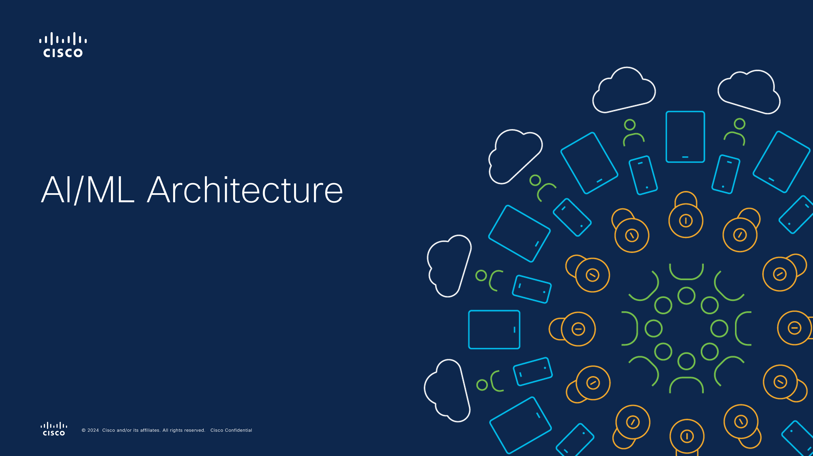
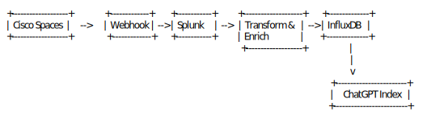

# Cisco AI-Driven Enterprise Data Architecture

## Table of Contents

- [Overview](#overview)
- [Key Benefits](#key-benefits)
  - [1. Accelerated Innovation](#1-accelerated-innovation)
  - [2. Enhanced Security & Data Control](#2-enhanced-security--data-control)
  - [3. Operational Simplicity](#3-operational-simplicity)
- [Solution Diagram](#solution-diagram)
- [Video - Architecture Overview](#video---architecture-overview)
- [Use Cases](#use-cases)
  - [Hybrid Cloud](#hybrid-cloud)
  - [Smart Buildings](#smart-buildings)
    - [Benefits](#benefits)
    - [Advanced Capabilities](#advanced-capabilities)
    - [Smart Building Data Flows](#smart-building-data-flows)
      - [Event-Driven Flow](#1-event-driven-flow)
      - [Machine Learning Driven Data Flow](#2-machine-learning-driven-data-flow)
      - [User Query Flow](#3-user-query-flow)
    - [Smart Building Use Cases](#smart-building-use-cases)
  - [Public Safety Use Cases](#public-safety-use-cases)
  - [Splunk & ChatGPT Integration Use Cases](#splunk--chatgpt-integration-use-cases)
- [Generative AI Support](#generative-ai-support)
  - [Generative AI Use Cases](#generative-ai-use-cases)
    - [1. Internet AI](#1-internet-ai)
    - [2. Enterprise Domain AI](#2-enterprise-domain-ai)
    - [3. Operational AI](#3-operational-ai)
  - [AI Platforms Supported](#ai-platforms-supported)
- [Deployment Options](#deployment-options)
  - [LLM Deployment Models](#llm-deployment-models)
  - [Machine Learning Deployment Options](#machine-learning-deployment-options)
- [Architectural Components](#architectural-components)
  - [Seamless Connectivity and Security](#seamless-connectivity-and-security)
  - [Comprehensive Visibility](#comprehensive-visibility)
  - [Data Ingestion and Correlation](#data-ingestion-and-correlation)
  - [Intelligent Interaction and Analytics](#intelligent-interaction-and-analytics)
- [How It Works](#how-it-works)
- [Advantages Over Traditional Architectures](#advantages-over-traditional-architectures)
- [Getting Started](#getting-started)
- [Conclusion](#conclusion)
- [References](#references)

---

## Overview

The **Cisco AI-Driven Enterprise Data Architecture** is a hybrid solution that combines the power of Azure Local running on Cisco UCS hardware with comprehensive Cisco connectivity and security products. This architecture leverages Azure services on-premises and in the cloud, enabling organizations to accelerate innovation, enhance security, and simplify operations.

---
## Key Benefits

### 1. Accelerated Innovation

- **Leverage Azure AI/ML Services**: Utilize Azure's advanced AI and machine learning capabilities directly on Cisco infrastructure.
- **Reduced Need for In-House Expertise**: Streamline adoption of AI/ML technologies without the requirement for specialized in-house skills.

### 2. Enhanced Security & Data Control

- **On-Premises Data Retention**: Keep sensitive data on-premises as needed, complying with regulatory requirements.
- **Secure Connectivity**: Cisco's Catalyst SD-WAN, Multicloud Defense, HyperShield, and Secure Firewall ensure secure and seamless connectivity between on-premises and cloud environments.

### 3. Operational Simplicity

- **Unified Management**: Manage all AI/ML workloads from the Azure portal, regardless of their deployment location—cloud, on-premises, branch offices, or IoT devices.
- **Consistent Operations**: Standardize processes across hybrid environments, reducing complexity and operational overhead.

---

## Solution Diagram

*Figure: High-level overview of the Cisco AI-Driven Enterprise Data Architecture.*
---

## Video - Architecture Overview

---

## Use Cases

### Hybrid Cloud

- **Flexible Workload Deployment**: Run workloads on-premises, in the cloud, or across multiple environments as business needs dictate.
- **Centralized Management**: Control and monitor all resources through the Azure portal, simplifying administration.

### Smart Buildings

Smart Buildings leverage the architecture to transform physical spaces into intelligent environments.

#### Benefits

- **Cost Savings**: Reduce capital and operational expenses by investing in a single, secure network infrastructure. Optimize energy usage through connected systems like HVAC, lighting, and occupancy sensors.
- **Energy Efficiency**: Lower energy consumption and accelerate the journey toward net-zero emissions with Power over Ethernet (PoE) solutions.
- **Enhanced Workplace Experience**: Create collaborative, safe, and flexible spaces suitable for hybrid work models, enabled by technologies like hot-desking and adaptable meeting rooms.
- **Improved Building Management**: Gain actionable insights into space utilization and resource availability, aiding in asset management and cost control.
- **Automation and Security**: Enhance physical security with advanced sensors and cameras, streamlining security management and reducing manual tasks.
- **Data-Driven Insights**: Utilize the Cisco Spaces platform to unify applications and data, offering insights into building behavior and optimizing workspaces for employee needs.
- **Future-Ready Design**: Design spaces that cater to current and future hybrid work demands, maximizing flexibility and space usage.

#### Advanced Capabilities

- **AI and Machine Learning Integration**: Analyze data from IoT devices and infrastructure to generate predictive insights, improving sustainability, public safety, and operational efficiency.
- **Predictive Maintenance**: Anticipate equipment failures and maintenance needs, reducing downtime and extending asset life.

### Device Connectivity Overview
The Smart Building environment is characterized by seamless connectivity between various devices (sensors, cameras, HVAC systems, etc.) and the hybrid data center. Cisco on-premises infrastructure integrates with Azure Cloud to ensure robust connectivity and security.

---

### Smart Building Data Flows

#### 1. Event-Driven Flow
In the event-driven data flow, a variety of devices within the smart building environment—such as IoT sensors, Cisco and third-party infrastructure devices, Meraki cameras, Webex endpoints, and HVAC systems—generate events that are transmitted in real time to centralized processing platforms. These events are routed to Splunk for correlation and analysis, enabling proactive monitoring and rapid issue detection.

---

#### 2. Machine Learning Driven Data Flow
This flow involves collecting telemetry data from various devices through gRPC using Telegraf or other ingestion options. The data is processed using AKS (Azure Kubernetes Service) Machine Learning models deployed on Cisco UCS hardware with Azure Local or connected directly to Azure AKS. This enables advanced analytics, predictive maintenance, and intelligent decision-making, with the results visualized in Splunk.

---

#### 3. User Query Flow
Users interact with smart building systems through a chatbot or other endpoint. Queries are processed using ChatGPT or LangChain, which fetch data from Cisco Spaces and other platforms via API calls to the API Firehouse. The results are processed using serverless functions or application logic and then returned to the user in real time.

---
#### Smart Building Use Cases

1. **Energy Consumption Forecasting for Sustainability**: Utilize AI to predict energy usage patterns and optimize energy consumption, contributing to sustainability goals.
2. **Predictive Building Maintenance**: Implement machine learning models to predict equipment failures before they occur, scheduling maintenance proactively.
3. **Security Risk Prediction and Incident Prevention**: Analyze security data to forecast potential risks and prevent incidents.
4. **Space Utilization Optimization for Real Estate**: Use occupancy data to optimize space usage, reducing real estate costs.
5. **Occupant Behavior Analysis for Comfort**: Adjust building systems in real-time based on occupant behavior to enhance comfort and productivity.
6. **Real-Time Performance Monitoring**: Monitor building systems in real-time for efficient operations and quick issue resolution.
7. **Sustainability Impact Reporting and Compliance**: Generate reports on sustainability metrics to ensure compliance with regulations and corporate goals.
8. **Real Estate Investment Optimization**: Use data analytics to make informed decisions about real estate investments and asset management.
9. **Building Security Forecasting**: Predict security threats using AI to enhance building safety.
10. **AI-Driven Facility Planning**: Leverage AI for strategic facility planning and resource allocation.

### Public Safety Use Cases

1. **Real-Time Threat Detection and Response**: Utilize AI to detect threats in real-time and automate responses.
2. **Automated Perimeter Monitoring**: Implement automated surveillance for perimeter security.
3. **Facial Recognition for Access Control**: Enhance campus security with facial recognition systems for access management.
4. **Behavioral Pattern Recognition**: Identify unusual behavior patterns for early threat detection.
5. **Crowd Management and Emergency Evacuation**: Use AI to manage crowds and optimize evacuation procedures during emergencies.
6. **Suspicious Object Detection**: Automatically detect and alert on suspicious objects left unattended.
7. **Gunshot Detection and Instant Response**: Implement acoustic sensors to detect gunshots and initiate immediate response protocols.
8. **License Plate Recognition**: Monitor vehicles entering and exiting premises for security purposes.
9. **Predictive Incident Forecasting**: Analyze historical data to predict and prevent future incidents.
10. **Automated Emergency Alerts and Communication**: Automate the dissemination of emergency information to stakeholders.

### Splunk & ChatGPT Integration Use Cases

1. **Automated Incident Analysis and Explanation**: Use ChatGPT to provide explanations of incidents detected by Splunk.
2. **Proactive Threat Hunting**: Leverage AI to proactively search for potential security threats in system logs.
3. **Interactive Query Generation**: Generate Splunk queries using natural language input via ChatGPT.
4. **Anomaly Detection Insights**: Utilize AI to interpret anomalies detected by Splunk and suggest actionable insights.
5. **Automated Report Generation**: Automatically create comprehensive reports on system performance and incidents.
6. **Incident Triage and Prioritization**: Use AI to prioritize incidents based on severity and potential impact.
7. **Real-Time Alert Explanation and Recommendations**: Provide immediate explanations and recommended actions for alerts.
8. **Natural Language Search of Logs and Metrics**: Allow users to search logs using natural language queries.
9. **AI-Driven Incident Response Playbooks**: Generate dynamic response playbooks for incidents using AI.
10. **Predictive Maintenance and IT Operations**: Forecast IT system maintenance needs to prevent downtime.

---

## Generative AI Support

The architecture fully supports Generative AI capabilities, enabling organizations to harness the power of advanced language models for various applications.

### Generative AI Use Cases

#### 1. Internet AI

- **Secure Internet Inquiry**: Perform internet-based queries without leaking sensitive data, ensuring privacy and compliance.

#### 2. Enterprise Domain AI

- **Secure Data Analysis**: Utilize generative AI to analyze enterprise data securely, extracting valuable insights while maintaining data confidentiality.

#### 3. Operational AI

- **Operational Intelligence**: Enhance operational efficiency through AI-driven insights, integrating Cisco AI capabilities for advanced analytics and decision-making.

### AI Platforms Supported

- **Azure OpenAI Chat**: Integrate Azure OpenAI services, including ChatGPT, for intelligent interaction and natural language processing tasks.
- **GenAI Chatbot on Hugging Face**: Deploy custom generative AI models using Hugging Face transformers for specialized applications.

---

## Deployment Options

The architecture offers flexible deployment models for Large Language Models (LLMs) and Machine Learning workloads, accommodating various organizational needs.

> **Note:** For detailed Cisco security solutions suitable for each deployment type, please refer to our [Deployment Options Guide](../deployment/deployment_options.md). Cisco offers flexible security solutions tailored to meet the specific needs of both Azure-managed and self-managed deployments.

### LLM Deployment Models

**LLM in Cloud Deployment Models**

1. **LLM in Cloud with Managed Cloud Endpoint**
2. **LLM in Cloud with Unmanaged Cloud Endpoint**
3. **LLM in Cloud with Managed On-Premises Endpoint**
4. **LLM in Cloud with Unmanaged On-Premises Endpoint**
5. **LLM in Cloud with Managed Hybrid Endpoints (Cloud and On-Premises)**
6. **LLM in Cloud with Unmanaged Hybrid Endpoints (Cloud and On-Premises)**
7. **LLM in Cloud with Mixed Managed/Unmanaged Hybrid Endpoints**
8. **LLM in Cloud with Mixed Unmanaged/Managed Hybrid Endpoints**

**LLM On-Premises Deployment Models**

9. **LLM On-Premises with Managed On-Premises Endpoint**
10. **LLM On-Premises with Unmanaged On-Premises Endpoint**
11. **LLM On-Premises with Managed Cloud Endpoint**
12. **LLM On-Premises with Unmanaged Cloud Endpoint**
13. **LLM On-Premises with Managed Hybrid Endpoints (Cloud and On-Premises)**
14. **LLM On-Premises with Unmanaged Hybrid Endpoints (Cloud and On-Premises)**
15. **LLM On-Premises with Mixed Managed/Unmanaged Hybrid Endpoints**
16. **LLM On-Premises with Mixed Unmanaged/Managed Hybrid Endpoints**

*Note: In all these models, the underlying infrastructure is deployed as a service through Azure. The terms 'managed' and 'unmanaged' relate to the endpoint application, not the infrastructure.*

### Machine Learning Deployment Options

1. **Training, Inference, and Endpoint using Cloud Compute**
2. **Training using HCI Compute; Inference and Endpoint using Cloud Compute**
3. **Training and Inference using HCI Compute; Endpoint using Cloud Compute**
4. **Training, Inference, and Endpoint using HCI Compute**
5. **Training using Cloud Compute; Inference and Endpoint using HCI Compute**
6. **Training using Cloud Compute; Inference using HCI Compute; Endpoint using Cloud Compute**
7. **Training using HCI Compute; Inference using Cloud Compute; Endpoint using HCI Compute**
8. **Training and Inference using Cloud Compute; Endpoint using HCI Compute**

These deployment options provide flexibility to balance performance, cost, data sovereignty, and compliance requirements.

---

## Architectural Components

### Seamless Connectivity and Security

- **Cisco Catalyst SD-WAN**: Provides intelligent routing and optimized WAN performance.
- **Cisco Multicloud Defense**: Secures workloads across multiple cloud environments.
- **Cisco HyperShield**: Offers enhanced security features for hybrid deployments.
- **Robust Intelligence**: Continuously monitors and tests AI models to identify and mitigate security, ethical, and operational risks in production.
- **Cisco Secure Firewall**: Protects against advanced threats with robust firewall capabilities.
  

### Comprehensive Visibility

- **Cisco ThousandEyes Integration**: Delivers full visibility into network traffic, ensuring performance monitoring throughout the hybrid environment.

### Data Ingestion and Correlation

- **Event and Data Routing**: All Cisco infrastructure components—including endpoints, Cisco Spaces, Catalyst Center, Webex Control Hub, and Meraki Cloud—stream events and raw data into the architecture.
- **Splunk Integration**: Facilitates real-time data correlation and analysis for informed decision-making.

### Intelligent Interaction and Analytics

- **Azure OpenAI with ChatGPT**: Enables intelligent interaction and advanced analytics, enhancing user experience and operational insights.
- **Hugging Face Integration**: Supports deployment of custom generative AI models for specialized applications.
- **Machine Learning Workloads**: Supports training and inference workloads both on-premises and in the cloud, utilizing Azure Machine Learning services.

---

## How It Works

1. **Data Collection**: Sensors, devices, and applications collect data across the enterprise.
2. **Secure Connectivity**: Data is securely transmitted using Cisco's networking and security solutions.
3. **Data Ingestion**: Events and raw data are ingested into the system, with Splunk handling real-time correlation.
4. **AI/ML Processing**: Azure Machine Learning and Azure OpenAI services process the data to generate insights.
5. **Generative AI Applications**: Leverage generative AI models for tasks like natural language processing, predictive analytics, and operational intelligence.
6. **Actionable Insights**: Predictive analytics inform decision-making in areas like sustainability, safety, and operational efficiency.
7. **Unified Management**: Administrators manage workloads and resources through the Azure portal.

---

## Advantages Over Traditional Architectures

- **Hybrid Flexibility**: Unlike traditional on-premises or cloud-only solutions, this architecture offers true hybrid capabilities.
- **Enhanced Security**: Comprehensive security features protect data both in transit and at rest.
- **Scalability**: Easily scale resources up or down based on workload demands.
- **Interoperability**: Seamlessly integrate with existing Cisco and Azure services.
- **Generative AI Support**: Enables advanced AI capabilities, enhancing operational intelligence and user experiences.

---

## Getting Started

To implement the Cisco AI-Driven Enterprise Data Architecture:

1. **Deploy Azure Local on Cisco UCS**: Follow the [getting started guide](/docs/getting_started.md) to set up the foundational infrastructure.
2. **Integrate Cisco Security Solutions**: Configure Catalyst SD-WAN, Multicloud Defense, HyperShield, and Secure Firewall.
3. **Set Up Azure Services**: Deploy Azure Arc, Azure Machine Learning, Azure OpenAI, and integrate Hugging Face models as needed.
4. **Configure Data Ingestion**: Route events and data from Cisco devices and applications into the architecture.
5. **Implement AI/ML and Generative AI Workloads**: Utilize the provided code and pipelines to start processing data and generating insights.
6. **Choose Deployment Options**: Select the appropriate LLM and Machine Learning deployment models based on your organizational needs.
7. **Monitor and Manage**: Use the Azure portal and Cisco management tools for ongoing operations.

---

## Conclusion

The Cisco AI-Driven Enterprise Data Architecture empowers organizations to harness the full potential of hybrid AI/ML and Generative AI solutions. By combining Cisco's robust infrastructure and security with Azure's advanced services, enterprises can accelerate innovation, maintain enhanced security, and achieve operational simplicity across their entire environment.

---

## References

- [Azure Local on Cisco UCS C-Series](cisco_azure_local.md)
- [Cisco Catalyst SD-WAN](cisco_catalyst_sdwan.md)
- [Cisco Multicloud Defense](cisco_multicloud_defense.md)
- [Azure Machine Learning](https://learn.microsoft.com/azure/machine-learning/)
- [Azure OpenAI Service](https://learn.microsoft.com/azure/ai-services/openai/)
- [Hugging Face Transformers](https://huggingface.co/transformers/)
- [Deployment Options/Security Considerations](/deployment/deployment_options.md)

 
---

*For detailed deployment instructions, please refer to the [Deployment Guides](../README.md#deployment-guides).*
